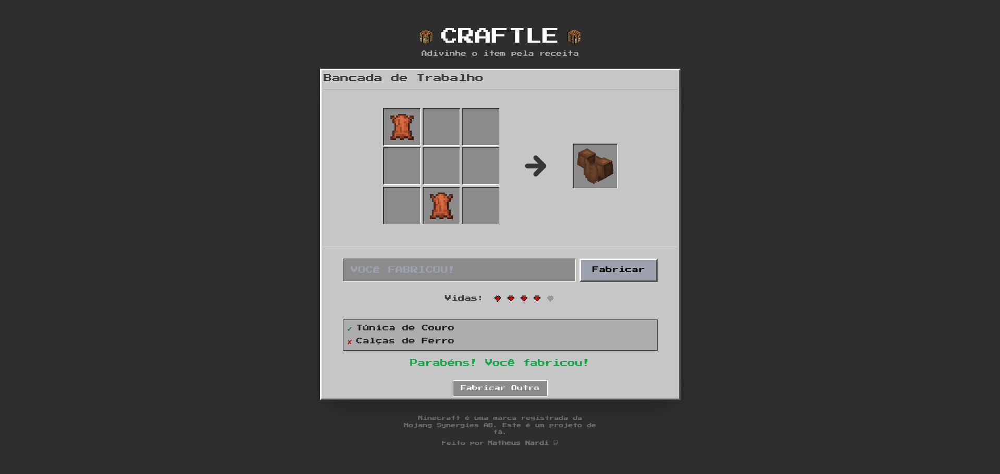

# Craftle

Um jogo de adivinhação inspirado no Wordle, mas com receitas de crafting do Minecraft! Adivinhe qual item está sendo fabricado observando os ingredientes revelados na bancada de trabalho.

## 🎮 Como Jogar

Você precisa descobrir qual item está sendo fabricado baseado nos ingredientes que são revelados gradualmente na grade de crafting 3x3. Cada erro revela mais um ingrediente, mas você tem um número limitado de vidas!

## 🌐 Jogue Agora

**[https://www.craftle.com.br/](https://www.craftle.com.br/)**

## 📸 Screenshot

